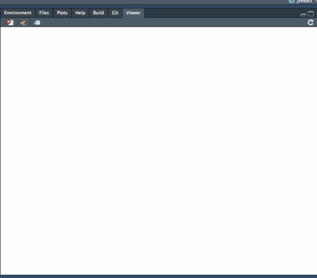

<!-- README.md is generated from README.Rmd. Please edit that file -->
jsReact
=======

jsReact is designed to help you utilise JavaScript's visualisation libraries and R's modelling packages to build tailor-made interactive apps. The basic framework is set, and at the moment I am expanding on **examples** (see the 'example' folder) and **tutorials** (see 'vignettes'). Collaboration is welcomed!

#### For more information, see the [website](https://kcf-jackson.github.io/jsReact/index.html) which contains [tutorials](https://kcf-jackson.github.io/jsReact/articles/articles/index.html), [examples](https://kcf-jackson.github.io/jsReact/articles/examples/gallery.html) and [package documentation](https://kcf-jackson.github.io/jsReact/reference/index.html).

=======

Installation
------------

jsReact is currently not available from CRAN, but you can install the development version from github with:

    # install.packages("devtools")
    devtools::install_github("kcf-jackson/jsReact")

Who might be interested in this package / repo ?
------------------------------------------------

-   Experienced R users who have heard JS is powerful, attempted to learn it but found the barrier too high.

-   Researchers who are happy to step up their data visualisation game with JS, but still want to do modelling in R.

Examples
--------

 

 
