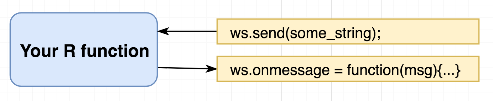
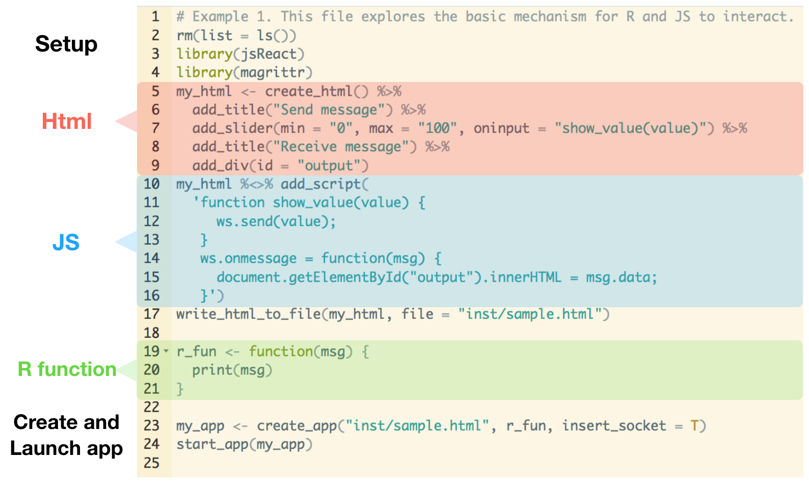
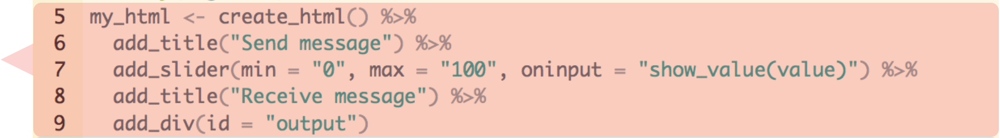
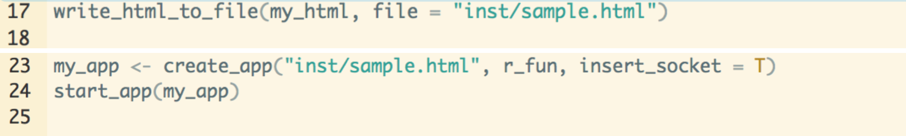

***


## 1.1 Basic framework

### Introduction
In this tutorial, we go through a simple example of interacting with JavaScript(JS) in R. 
To create an app, you will need a html file to display your app along with some JS to specify how the app behaves. And since we want to do all this in R, we also need R.

{width=50%}

Don't worry about it if you don't have a html file and a js file at the moment, we will build them together very soon. For now, just focus on the high-level understanding. To make R talk to JS, you need three functions:

1. `ws.send(str0)`("ws" stands for "websocket"): this command lives in JS, and it sends a string to R every time it's called. The common usage is `ws.send(JSON.stringify(my_complex_data))`, where we convert the (JSON) data into a string using `JSON.stringify`; this function applies to all lists in JS. 

2. `ws.onmessage(msg) = function { ... }`: this function lives in JS. It continuously monitors if R has sent JS a message, and it runs the code in the body when it gets a message. The message contains many things other than your data, and we can use `JSON.parse(msg.data)` to extract the data from it.

3. Your R function (well, clearly) lives in R. It describes what R should do when JS sends R some data. The input is assumed to be a named list, and the output must also be a named list. 

The following is a common pattern to use. It is very flexible; in fact, all examples in the package are created under this framework. Additional patterns can be created, but we shall leave that to another tutorial.

{width=70%}

***

### Two simple examples

#### Example 1 

- JavaScript
```
ws.send("hi");
ws.onmessage = function(msg) {
  var r_data = JSON.parse(msg.data);
  console.log(r_data['r_msg']);   // this prints the message in JS console
}
```

- R
```
my_r_function <- function(msg) {
  print(msg)  # this will print the message in R console
  list(r_msg = msg)  # return the message to JS
}
```

#### Example 2
- JavaScript
```
ws.send("JSON.stringify({x:3, y:4})");    // sends a named list in JS to R
ws.onmessage = function(msg) {
  var r_data = JSON.parse(msg.data);
  console.log(r_data['r_msg'], r_data['z']);   // this prints the message in JS console
}
```

- R
```
my_r_function <- function(msg) {
  print(msg)   # this will print the message in R console
  print(msg$x) # expects 3
  print(msg$y) # expects 4
  list(r_msg = msg, z = rnorm(1))  # return the message to JS
}
```

***

## 1.2 Our first app

Now we are ready to create our first app, which looks like this:

{width=50%}

The goal is to get ourselves familiar with the JS-R communication model and the whole app development process. The full code can be found [here](https://github.com/kcf-jackson/jsReact/blob/master/inst/example.R).

***

### 1.2.1 App interface
First, let's inspect the interface.

{width=50%}

Two comments to make:

- To create a slider, you need to specify these three attributes: `min, max, oninput`. `min, max` refers to the minimum and maximum value the slider can take; `oninput` refers to a function which describes the desired behaviour when the slider is moved.

- In html, most things are just containers with different defaults. Containers are referred to as `<div>` elements.

***

### 1.2.2 Code
Next, let's decompose and analyse the codes.

{width=80%}

The code is divided into four sections: Html, JS, R and others. Thanks to the `jsReact` package, the code can be developed entirely in R. Though as you get more experienced and the app gets more complicated, it is preferable to create the html, js and R files separately. (Side note: this is where beginners, e.g. me, got tripped up, and this is partly why I created this package.)

***

#### Html 
{width=80%}

- The code is fairly self-explanatory. You create a empty html (`create_html`), add a title (`add_title`), a slider(`add_slider`) and another title, then add a container (`add_div`).

- We give the container an `id` as later we want to refer to it and update its content.

***

#### Javascript
{width=80%}

- `show_value(value)` takes the slider value and send the value to R.

- `ws.onmessage(msg)` takes a message from R and display it on the `<div>` container we created previously. `document.getElementById("_ID_")` is the easiest way to refer to a particular element in a html file. We will use that quite often.

- In JS, both `function NAME(ARG) {...}` and `NAME = function(ARG) {...}` are valid ways to create functions.

***

#### R function
{width=80%}

- This R function prints the message it gets from the JS side (which is the slider value in our case).

***

#### Others
{width=80%}

`write_html_to_file`, `create_app` and `start_app` are three functions from the `jsReact` package that helps you build and run an app. 

- `write_html_to_file` writes the html object we created in the previous section to hard-drive. This is not needed if you supply your own html file.

- `create_app` links the html and the R function you provided (using the model presented in Diagram 2) and creates an app object. `insert_socket` is by default `TRUE`; you could set it to `FALSE` if you are not doing any R processing.

- `start_app` launches a R server to serve your website. By default, the address is set to "localhost:9454", and the website is shown in your viewer. You can use the option `browser = "browser"` to open the app with your browser instead.

***

## 1.3 Summary
In this tutorial, we went through how to interact with JavaScript in R. The package `jsReact` setups a simple framework for this, and the three key functions to know are: 

- `ws.send(str0)`, `ws.onmessage(msg)` and  `your_r_function(named_list0) { named_list1 }`. 

Along the way, we have also learnt about some useful functions for apps development:

- for building the html interface, we have `jsReact::add_title, jsReact::add_slider, jsReact::add_div`; 

- for JavaScript, we have `document.getElementById('_ID_')`;

- for running the app, we have `jsReact::write_html_to_file(), jsReact::create_app(), jsReact::start_app()`.

I hope you successfully created an app in R, and I shall see you in the next tutorial!
